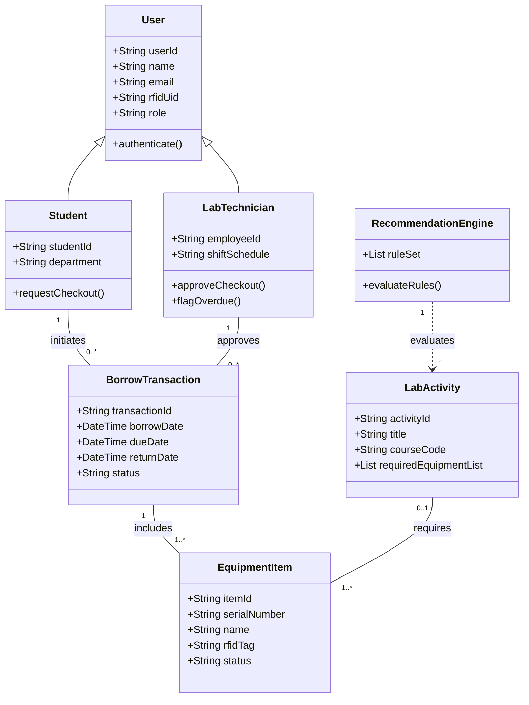
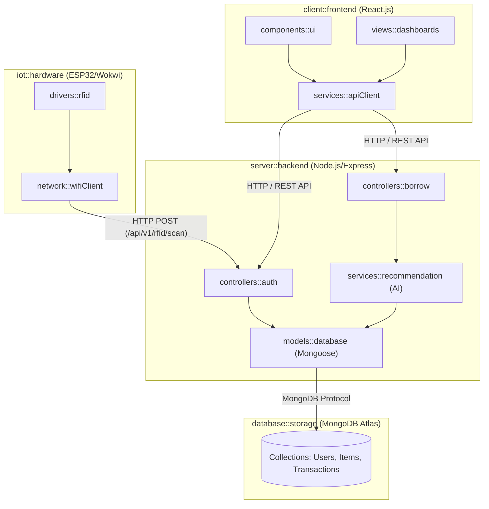
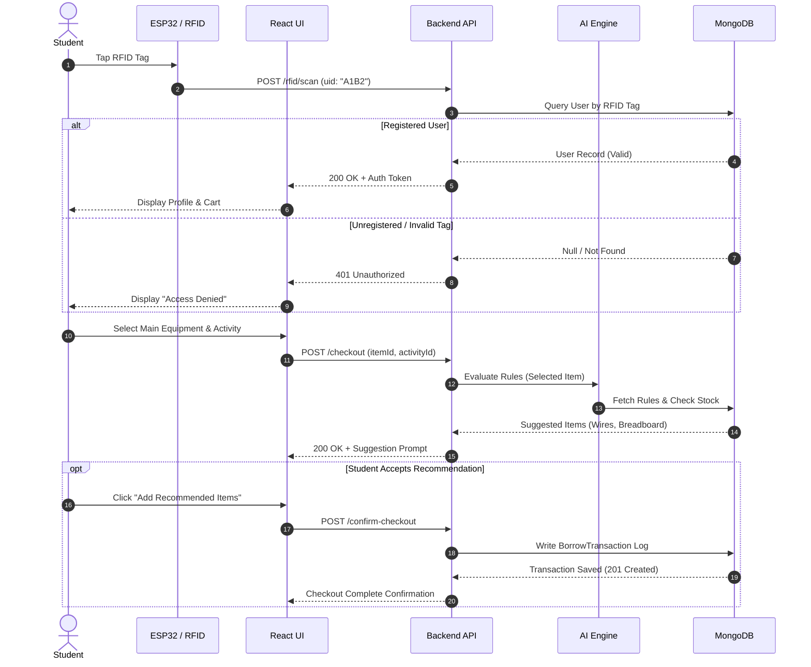
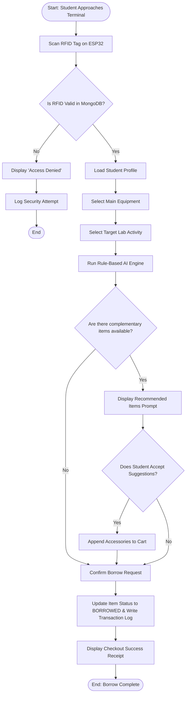

### 1. Domain Class Diagram

```mermaid
classDiagram
    class User {
        +String userId
        +String name
        +String email
        +String rfidUid
        +String role
        +authenticate()
    }

    class Student {
        +String studentId
        +String department
        +requestCheckout()
    }

    class LabTechnician {
        +String employeeId
        +String shiftSchedule
        +approveCheckout()
        +flagOverdue()
    }

    class EquipmentItem {
        +String itemId
        +String serialNumber
        +String name
        +String rfidTag
        +String status
    }

    class LabActivity {
        +String activityId
        +String title
        +String courseCode
        +List requiredEquipmentList
    }

    class BorrowTransaction {
        +String transactionId
        +DateTime borrowDate
        +DateTime dueDate
        +DateTime returnDate
        +String status
    }

    class RecommendationEngine {
        +List ruleSet
        +evaluateRules()
    }

    User <|-- Student
    User <|-- LabTechnician
    Student "1" -- "0..*" BorrowTransaction : initiates
    LabTechnician "1" -- "0..*" BorrowTransaction : approves
    BorrowTransaction "1" -- "1..*" EquipmentItem : includes
    LabActivity "0..1" -- "1..*" EquipmentItem : requires
    RecommendationEngine "1" ..> "1" LabActivity : evaluates
```
### 2. Package Diagram

```mermaid
graph TD
    subgraph Client_Frontend ["client::frontend (React.js)"]
        UI["components::ui"]
        Dashboards["views::dashboards"]
        APIClient["services::apiClient"]
        UI --> APIClient
        Dashboards --> APIClient
    end

    subgraph Server_Backend ["server::backend (Node.js/Express)"]
        AuthCtrl["controllers::auth"]
        BorrowCtrl["controllers::borrow"]
        RecEngine["services::recommendation (AI)"]
        DBModels["models::database (Mongoose)"]
        
        AuthCtrl --> DBModels
        BorrowCtrl --> RecEngine
        RecEngine --> DBModels
    end

    subgraph Database_Storage ["database::storage (MongoDB Atlas)"]
        DB[(Collections: Users, Items, Transactions)]
    end

    subgraph IoT_Hardware ["iot::hardware (ESP32/Wokwi)"]
        RFIDDriver["drivers::rfid"]
        WiFiClient["network::wifiClient"]
        RFIDDriver --> WiFiClient
    end

    APIClient -- "HTTP / REST API" --> AuthCtrl
    APIClient -- "HTTP / REST API" --> BorrowCtrl
    WiFiClient -- "HTTP POST (/api/v1/rfid/scan)" --> AuthCtrl
    DBModels -- "MongoDB Protocol" --> DB
```
### 3. Sequence Diagram

```mermaid
sequenceDiagram
    autonumber
    actor Student
    participant ESP32 as ESP32 / RFID
    participant ReactUI as React UI
    participant API as Backend API
    participant AI as AI Engine
    participant DB as MongoDB

    Student->>ESP32: Tap RFID Tag
    ESP32->>API: POST /rfid/scan (uid: "A1B2")
    API->>DB: Query User by RFID Tag
    
    alt Registered User
        DB-->>API: User Record (Valid)
        API-->>ReactUI: 200 OK + Auth Token
        ReactUI-->>Student: Display Profile & Cart
    else Unregistered / Invalid Tag
        DB-->>API: Null / Not Found
        API-->>ReactUI: 401 Unauthorized
        ReactUI-->>Student: Display "Access Denied"
    end

    Student->>ReactUI: Select Main Equipment & Activity
    ReactUI->>API: POST /checkout (itemId, activityId)
    API->>AI: Evaluate Rules (Selected Item)
    AI->>DB: Fetch Rules & Check Stock
    DB-->>API: Suggested Items (Wires, Breadboard)
    API-->>ReactUI: 200 OK + Suggestion Prompt

    opt Student Accepts Recommendation
        Student->>ReactUI: Click "Add Recommended Items"
        ReactUI->>API: POST /confirm-checkout
        API->>DB: Write BorrowTransaction Log
        DB-->>API: Transaction Saved (201 Created)
        API-->>ReactUI: Checkout Complete Confirmation
    end
```
### 4. Activity Diagram

```mermaid
flowchart TD
    Start([Start: Student Approaches Terminal]) --> Scan[Scan RFID Tag on ESP32]
    Scan --> CheckUser{Is RFID Valid in MongoDB?}
    
    CheckUser -- No --> AccessDenied[Display 'Access Denied']
    AccessDenied --> LogIncident[Log Security Attempt] --> EndDenied([End])
    
    CheckUser -- Yes --> LoadProfile[Load Student Profile]
    LoadProfile --> SelectItem[Select Main Equipment]
    SelectItem --> SelectActivity[Select Target Lab Activity]
    SelectActivity --> RunAI[Run Rule-Based AI Engine]
    
    RunAI --> CheckRecs{Are there complementary items available?}
    
    CheckRecs -- Yes --> DisplayPrompt[Display Recommended Items Prompt]
    CheckRecs -- No --> ConfirmCheckout
    
    DisplayPrompt --> AcceptRecs{Does Student Accept Suggestions?}
    AcceptRecs -- Yes --> AppendCart[Append Accessories to Cart] --> ConfirmCheckout
    AcceptRecs -- No --> ConfirmCheckout[Confirm Borrow Request]
    
    ConfirmCheckout --> UpdateDB[Update Item Status to BORROWED & Write Transaction Log]
    UpdateDB --> Receipt[Display Checkout Success Receipt]
    Receipt --> EndSuccess([End: Borrow Complete])
```